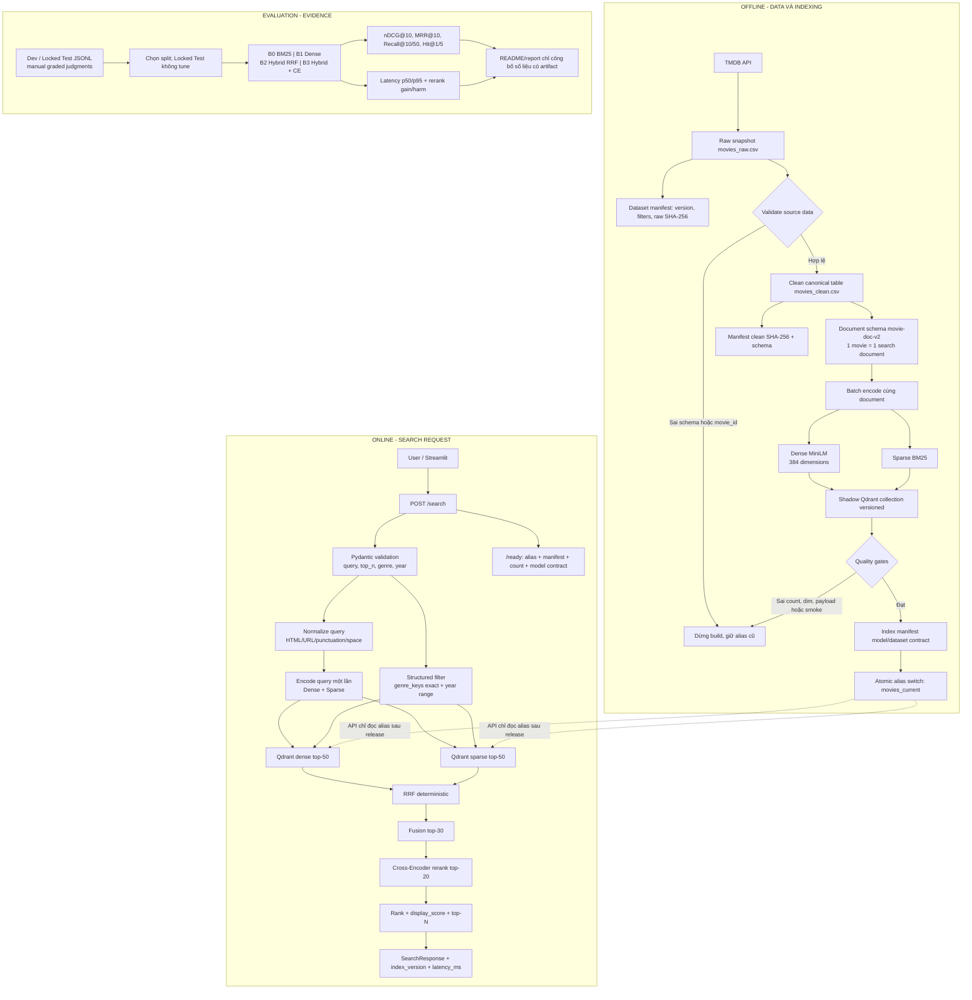

# MovieScout Hybrid Movie Retrieval


MovieScout là hệ thống tìm kiếm phim theo mô tả tự nhiên. Người dùng không cần
nhớ tên phim; họ mô tả cốt truyện, chủ đề hoặc tên người liên quan, sau đó có
thể lọc thêm theo thể loại và năm phát hành.

## Bài toán và phạm vi ứng dụng (Problem & Scope)

### Bài toán

- Đầu vào là query tiếng Anh mô tả phim, có thể kèm `genre` và `year`.
- Catalog gồm phim TMDB có `overview` không rỗng, được lấy theo snapshot có
  version và hash.
- Một phim tương ứng đúng một Qdrant point. Đây là search entity, không phải
  kho tài liệu RAG nên không chunk và không aggregate nhiều đoạn.
- Đầu ra là top-N phim kèm metadata, `rank`, điểm Cross-Encoder và điểm hiển
  thị tương đối trong chính result set.

### Phạm vi v1

Production v1 cố định vào information retrieval có thể kiểm tra và tái lập:

- Dense: `sentence-transformers/all-MiniLM-L6-v2`.
- Sparse lexical: `Qdrant/bm25` qua FastEmbed.
- Fusion: Reciprocal Rank Fusion (RRF).
- Precision stage: `cross-encoder/ms-marco-MiniLM-L-6-v2`.
- Vector database: Qdrant; API luôn đọc alias `movies_current`.
- Serving: FastAPI; Streamlit chỉ là client UI gọi FastAPI.
- Metadata filters: genre và year.

HyDE, Adaptive Router, query rewrite, LLM, popularity và rating không nằm trong
online path v1. HyDE/router cũ chỉ ở `experiments/adaptive_search/` để chạy
experiment riêng; dependency Groq là tùy chọn.

### Ngoài phạm vi v1

- Chỉ claim hỗ trợ query tiếng Anh; tiếng Việt/multilingual là hạn chế hiện tại.
- `vote_average` và `popularity` chỉ là metadata hiển thị, không đổi relevance.
- Không có user profile, history, collaborative filtering hoặc personalization.
- Benchmark synthetic cũ không được dùng làm headline public nếu chưa review
  judgment độc lập.

## Luồng logic, luồng data và pipeline kỹ thuật duy nhất

Sơ đồ này là contract chung chi phối code, cấu hình, release index và báo cáo.
Mọi thay đổi model, document hoặc retrieval budget phải đi qua đúng các gate.



### Logic offline

1. `pipeline.ingest` gọi TMDB, loại trùng `movie_id`, yêu cầu overview không
   rỗng và ghi `dataset_version` vào từng record.
2. `pipeline.manifest` ghi source, khoảng năm, sort, số trang, số phim và
   SHA-256 raw snapshot.
3. `pipeline.clean` kiểm tra schema, chuẩn hóa text, chuyển `cast`, `genres`,
   `keywords` thành JSON array, tạo `release_year` và `combined_text`; manifest
   được cập nhật thêm clean hash.
4. `pipeline.dual_embedding_qdrant` build collection mới
   `movies_<INDEX_VERSION>`, không upsert trực tiếp collection đang serve.
5. Sau khi count, dimension, payload và smoke query đạt, index manifest mới
   được ghi rồi alias mới switch atomic. Build lỗi không làm đổi alias cũ.

### Logic online

1. FastAPI giới hạn query 500 ký tự, `top_n` trong `1..RERANK_K`, year dạng
   `YYYY` hoặc `YYYY-YYYY`.
2. Query normalize nhẹ và deterministic; không stemming, LLM hay classifier.
3. Hai vector encode một lần; hai branch Qdrant chạy song song cùng filter và
   `RETRIEVAL_K=50`.
4. RRF dùng rank 1-based, chỉ để chọn candidate; RRF score không phải
   confidence/xác suất.
5. Reranker chỉ thấy `FUSION_CANDIDATE_K=30` candidate, tối đa `RERANK_K=20`;
   API trả tối đa `top_n`.
6. Cache LRU có `index_version`, query normalized, filter, `top_n`, debug. Khi
   release version mới, cache tự miss.

## Hợp đồng dữ liệu và điểm số

`combined_text` có thứ tự schema cố định:

```text
Title: Interstellar. Director: Christopher Nolan. Cast: Matthew McConaughey, Anne Hathaway.
Genres: Adventure, Drama, Science Fiction. Keywords: space, wormhole.
Overview: A team of explorers travels through a wormhole in space.
```

Payload Qdrant:

| Nhóm | Trường | Ý nghĩa |
| --- | --- | --- |
| Identity | `movie_id` | ID TMDB duy nhất |
| Search | `document_text` | Text versioned cho encode/rerank |
| List metadata | `genres`, `genre_keys`, `cast`, `keywords` | Array; `genre_keys` là bản `casefold()` để exact filter |
| Scalar metadata | `title`, `director`, `overview`, `release_date`, `release_year` | Hiển thị và filter năm |
| Display only | `vote_average`, `popularity`, `poster_path` | Không vào relevance score |
| Provenance | `document_schema_version` | Chặn mismatch khi build/query |

`movie-doc-v2` là một phần của model-index contract. Đổi field, thứ tự field,
cách clean hoặc số lượng cast/keywords phải tăng schema/index version và build
lại collection.

Điểm trả về có ý nghĩa như sau:

- `rrf_score`: điểm fusion nội bộ cho debug/evaluation.
- `rerank_score`: điểm thô Cross-Encoder, không phải xác suất.
- `rank`: thứ tự cuối cùng.
- `display_score`: min-max trong result set để vẽ UI; không so sánh giữa query
  và không dùng để route/reject query.

## Cấu trúc thư mục dự án

```text
.
├── app/api.py                         FastAPI health, ready, search contract
├── pipeline/
│   ├── ingest.py                      TMDB snapshot + dataset manifest
│   ├── clean.py                       Canonical schema + combined_text
│   ├── manifest.py                    Raw/clean provenance
│   ├── dual_embedding_qdrant.py       Shadow index + gates + alias release
│   └── data/                           CSV sinh; bị gitignore
├── retrieval/
│   ├── config.py                      Model, index, budget, cache settings
│   ├── manifest.py                    Model-index contract + SHA-256
│   ├── query.py                       Normalize + dual encode query
│   ├── store.py                       Qdrant alias/readiness/dual branch
│   ├── ranking.py                     RRF + structured payload + display score
│   ├── rerank.py                      Cross-Encoder reranking
│   ├── search.py                      Orchestrator online duy nhất
│   └── service.py                     LRU cache + latency
├── evaluation/
│   ├── README.md                      Evaluation contract
│   ├── dev_queries.jsonl              Dev judgments để tune
│   ├── locked_test_queries.jsonl      Locked judgments sau freeze
│   ├── eval_queries_200.csv           Synthetic regression legacy
│   ├── synthetic.py                   CLI kiểm tra synthetic BM25/Dense
│   ├── judgments.py                   JSONL loader
│   ├── metrics.py                     nDCG, MRR, Recall, Hit
│   ├── errors.py                      Failure stage + gain/harm
│   └── benchmark.py                   B0-B3 ablation
├── experiments/adaptive_search/      HyDE/router ngoài production path
├── scripts/                           Build, validate, evaluate CLIs
├── tests/                             Unit, API, ranking, manifest, service
├── ui/app.py                          Streamlit client gọi FastAPI
├── reports/                          Báo cáo Word tham khảo lịch sử
├── .github/workflows/ci.yml           Ruff + pytest trên push/PR
├── Dockerfile                         Image API/UI/indexer
├── docker-compose.yml                 API, UI, Qdrant, profile indexer
├── pyproject.toml                     Dependency và CLI duy nhất
└── README.md                          Tài liệu contract này
```

`data/manifests/`, `pipeline/data/movies_raw.csv` và
`pipeline/data/movies_clean.csv` được sinh khi chạy pipeline; dataset đầy đủ và
secret không được đưa vào Git.

## Cài đặt và chạy thử nghiệm

Yêu cầu: Python 3.10+, Git và Qdrant local/cloud. Dependency chỉ lấy từ
`pyproject.toml`:

```powershell
python -m venv .venv
.\.venv\Scripts\Activate.ps1
python -m pip install --upgrade pip
python -m pip install -e ".[dev]"
Copy-Item .env.example .env
```

Cấu hình chính:

| Biến | Mặc định | Vai trò |
| --- | --- | --- |
| `TMDB_API_KEY` | bắt buộc khi ingest | Khóa TMDB |
| `QDRANT_URL` | rỗng | Native thường `http://localhost:6333` |
| `QDRANT_API_KEY` | rỗng | Khóa Qdrant Cloud; local để trống |
| `QDRANT_INDEX_ALIAS` | `movies_current` | Alias API đọc |
| `INDEX_VERSION` | `tmdb-local-minilm-v2` | Collection/manifest version |
| `DENSE_MODEL` | `all-MiniLM-L6-v2` | Dense encoder |
| `SPARSE_MODEL` | `Qdrant/bm25` | Sparse encoder |
| `RERANK_MODEL` | `cross-encoder/ms-marco-MiniLM-L-6-v2` | Reranker |
| `RETRIEVAL_K` / `FUSION_CANDIDATE_K` / `RERANK_K` | `50 / 30 / 20` | Candidate budgets |
| `RRF_K` | `60` | Hằng số RRF |
| `MOVIESCOUT_API_URL` | `http://localhost:8000` | URL FastAPI của UI |

Khởi động Qdrant local rồi chạy pipeline đúng thứ tự:

```powershell
docker run --name moviescout-qdrant -p 6333:6333 qdrant/qdrant:v1.13.2
python -m pipeline.ingest
python -m pipeline.clean
python -m scripts.build_index
python -m scripts.validate_index
```

Ingestion mặc định lấy phim từ 1990 đến 2026, sort `popularity.desc`, tối đa 25
trang mỗi năm và chỉ yêu cầu overview không rỗng. Không lọc ngầm theo rating.
Raw/clean/index provenance được ghi qua dataset và index manifest.

Nếu alias đang trỏ tới cùng `INDEX_VERSION`, hãy đổi version trước khi build lại.
Builder sẽ từ chối xóa collection đang phục vụ traffic.

Chạy API và UI ở hai terminal sau khi index release:

```powershell
uvicorn app.api:app --reload --port 8000
streamlit run ui/app.py
```

UI chỉ gọi `MOVIESCOUT_API_URL/search`; API là nơi duy nhất giữ encoder,
reranker và logic online.

API endpoints:

- `GET /health`: liveness, không phụ thuộc Qdrant.
- `GET /ready`: kiểm tra Qdrant, alias, manifest, count và dense dimension; lỗi
  trả `503`.
- `POST /search`: Dense + BM25 → RRF → Cross-Encoder.

Ví dụ request:

```powershell
Invoke-RestMethod -Method Post -Uri http://localhost:8000/search `
  -ContentType "application/json" `
  -Body '{"query":"a father communicates with his daughter through a black hole","top_n":5,"genre":"Science Fiction","year":"2010-2020"}'
```

Response gồm `query`, `results`, `index_version`, `latency_ms`; mỗi result có
metadata, `rank`, `rerank_score` và `display_score`. Thêm `"debug": true` để
nhận evidence `dense_rank`, `sparse_rank`, `rrf_rank`, `rrf_score`.

## Docker Compose

Compose tách UI → API → Qdrant:

```powershell
Copy-Item .env.example .env
docker compose up --build qdrant api app
```

- UI: `http://localhost:8501`
- API: `http://localhost:8000/docs`
- Qdrant: `http://localhost:6333`

Trong container, Compose override `QDRANT_URL` thành `http://qdrant:6333` và
`MOVIESCOUT_API_URL` thành `http://api:8000`. Profile indexer dùng khi canonical
CSV đã có trên host:

```powershell
docker compose --profile tools run --rm indexer
```

## Evaluation và báo cáo

`evaluation/eval_queries_200.csv` là synthetic regression legacy để bắt
regression, named entity và metadata sanity; nhiều query gần field đang index
nên không dùng làm headline quality claim.

`dev_queries.jsonl` dùng để tune `retrieval_k`, `candidate_k`, `rerank_k`,
document và filter. `locked_test_queries.jsonl` chỉ chạy sau khi freeze config.
Theme query dùng graded judgment: `3` rất phù hợp, `2` phù hợp, `1` một phần,
`0` không phù hợp.

```powershell
python -m scripts.evaluate_dev
python -m scripts.evaluate_final
```

Chạy synthetic riêng bằng `python -m evaluation.synthetic`; output nằm ở
`evaluation/reports/synthetic/`. Module này thay cho `retrieval.evaluate_simple`.

B0–B3 là BM25, Dense, Hybrid RRF, Hybrid RRF + Cross-Encoder. Metric chính là
`nDCG@10`; known-item dùng thêm `MRR@10`, `Hit@1/5`; candidate generation dùng
`Recall@50`; báo cáo thêm `p50/p95` và `rerank_gain_harm.csv`. Benchmark dùng
chung một lần encode/retrieval cho mỗi query nên ranking có cùng evidence.

Output mặc định:

```text
evaluation/reports/dev/
├── benchmark_results.csv
├── benchmark_summary.csv
└── rerank_gain_harm.csv
```

Không ghi metric vào README nếu chưa có artifact và chưa review judgment. Không
dùng accuracy làm metric headline vì đây là bài toán ranking, không phải
classification.

## CI và repo cleanliness

Quality gate local:

```powershell
ruff check .
python -m compileall -q app evaluation experiments pipeline retrieval scripts tests ui
python -m pytest tests -q
```

GitHub Actions chạy Ruff, compileall và pytest trên mọi push/pull request. CI không gọi TMDB,
không tải model nặng, không cần Qdrant thật nên kết quả lặp lại ổn định; build
index và benchmark đầy đủ được chạy riêng khi có service/artifact.

Các invariant phải giữ:

- `movie_id` duy nhất và UUID point ổn định theo movie ID.
- Raw → clean → index giữ dataset version, hash và document schema.
- Query model, index model, dimension và schema khớp manifest contract.
- Alias chỉ switch sau quality gates; build lỗi không phá index đang serve.
- Genre là exact categorical filter trên `genre_keys`; year là range.
- RRF deterministic; rating/popularity không ảnh hưởng relevance.
- Reranker chỉ thấy candidate sau RRF.
- Một branch Qdrant lỗi vẫn fallback; cả hai lỗi trả `503`.

Các tài liệu Markdown legacy/trùng lặp đã được loại khỏi repo; `README.md` và
`evaluation/README.md` là hai tài liệu Markdown chính. HyDE/router vẫn được giữ
ở `experiments/` để truy vết nhưng không được import bởi production search.
Kết quả mới ghi vào `evaluation/reports/` và được gitignore; script tạo báo cáo
một lần đã được xóa. `reports/` giữ báo cáo Word lịch sử để tham khảo.

## Hạn chế và hướng mở rộng có kiểm soát

Model/query v1 ưu tiên tiếng Anh, catalog phụ thuộc snapshot TMDB, Qdrant và
model phải sẵn sàng, còn Dev/Locked judgments mẫu cần review thủ công trước khi
claim public. Chỉ đưa HyDE, router hoặc multilingual trở lại sau khi benchmark
độc lập chứng minh gain đủ lớn so với latency, chi phí và độ phức tạp.
