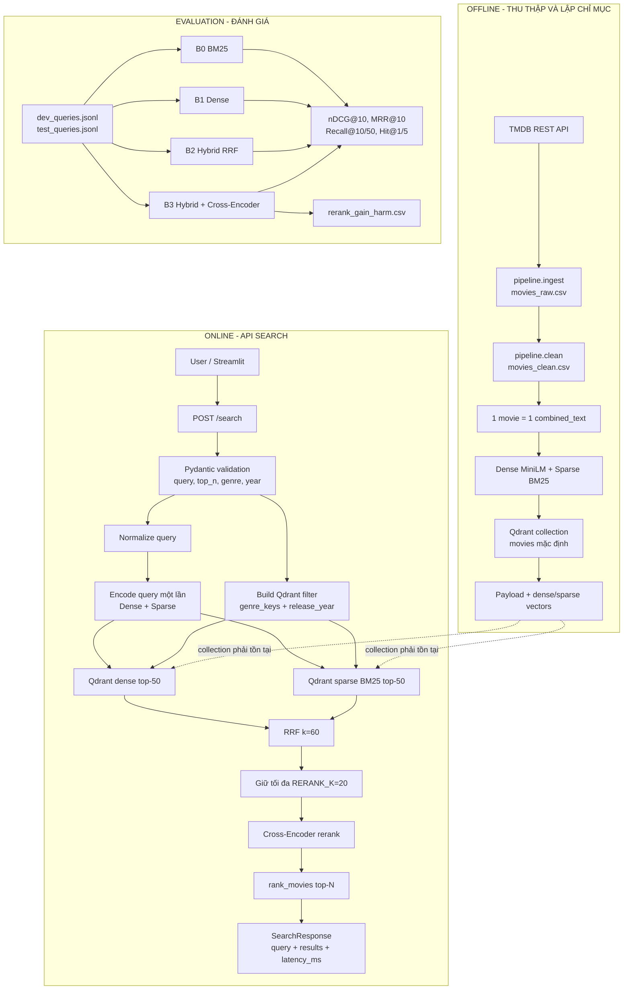

# MovieScout Hybrid Movie Search


MovieScout tìm phim bằng mô tả tự nhiên tiếng Anh. Hệ thống kết hợp dense
semantic retrieval, sparse BM25, Reciprocal Rank Fusion và Cross-Encoder
reranking. Streamlit chỉ là giao diện; toàn bộ logic tìm kiếm chạy trong FastAPI.

## Bài toán và phạm vi ứng dụng (Problem & Scope)

Người dùng thường nhớ nội dung phim nhưng không nhớ tiêu đề. Dense retrieval
bắt ngữ nghĩa cốt truyện; BM25 giữ tên riêng, đạo diễn, diễn viên và từ khóa hiếm.

Phạm vi hiện tại:

- Input: query tiếng Anh, `top_n`, thể loại và năm hoặc khoảng năm.
- Catalog: dữ liệu TMDB, một dòng tương ứng một phim.
- Output: metadata phim, `rank`, `rerank_score` và `latency_ms`.
- Dense model: `all-MiniLM-L6-v2`, mặc định 384 chiều.
- Sparse model: `Qdrant/bm25` qua FastEmbed.
- Fusion: RRF với `RRF_K=60`.
- Reranker: `cross-encoder/ms-marco-MiniLM-L-6-v2`.
- Vector store: Qdrant, collection từ `QDRANT_COLLECTION`, mặc định `movies`.

HyDE, router, LLM, popularity và rating không tham gia relevance score trong
production path hiện tại. Rating và popularity chỉ được lưu để hiển thị.

## Luồng logic, luồng data và pipeline kỹ thuật



### Luồng offline

1. `pipeline.ingest` gọi TMDB theo từng năm, lấy tối đa 25 trang mỗi năm trong
   khoảng 1990–2026, loại phim không có `overview` và loại trùng `movie_id`.
2. `pipeline.clean` kiểm tra cột bắt buộc, chuẩn hóa metadata, chuyển
   `cast`/`keywords`/`genres` thành JSON array, tạo `release_year` và
   `combined_text`.
3. `pipeline.dual_embedding_qdrant` đọc `movies_clean.csv`, tạo dense vector,
   sparse BM25 vector và payload cho từng phim.
4. Builder tạo collection từ `QDRANT_COLLECTION`, tạo vector space `dense` và
   `sparse`, lập payload index cho `movie_id`, `genre_keys`, `release_year`, sau
   đó upsert theo batch 32.
5. Builder kiểm tra tổng point sau upsert. Collection cũ cùng tên bị xóa khi
   build lại; cần bảo đảm không có traffic trong lúc rebuild.

### Luồng online

1. FastAPI xác thực request. `query` tối đa 500 ký tự, `top_n` trong
   `1..RERANK_K`, genre tối đa 80 và year tối đa 20 ký tự.
2. Query được xóa HTML, URL, dấu câu và khoảng trắng thừa. Query rỗng sau khi
   làm sạch trả `422`.
3. Genre là exact match không phân biệt hoa thường trên `genre_keys`; year là
   range trên `release_year`. Năm hợp lệ là `YYYY`, `YYYY-YYYY` hoặc
   `YYYY to YYYY`, trong khoảng 1888–2100.
4. Dense và sparse vector được tạo một lần. Qdrant chạy hai nhánh song song,
   mỗi nhánh lấy tối đa `RETRIEVAL_K=50`.
5. RRF giữ tối đa `RERANK_K=20` candidate rồi Cross-Encoder chấm điểm. `rank_movies`
   sắp xếp, gán rank 1-based và trả tối đa `top_n`.

## Hợp đồng dữ liệu và điểm số

`combined_text` giữ thứ tự field cố định:

```text
Title: Interstellar. Director: Christopher Nolan. Cast: Matthew McConaughey.
Genres: Adventure, Drama. Keywords: space, wormhole.
Overview: A team of explorers travels through a wormhole in space.
```

Payload Qdrant:

| Nhóm | Trường | Vai trò |
| --- | --- | --- |
| Identity | `movie_id` | ID TMDB duy nhất; point ID là UUID ổn định |
| Search | `document_text` | Text dùng cho Cross-Encoder |
| Metadata | `title`, `director`, `cast`, `genres`, `keywords`, `overview` | Hiển thị và tạo document |
| Filter | `genre_keys`, `release_year` | Exact genre và range year |
| Display | `release_date`, `vote_average`, `popularity`, `poster_path` | Chỉ hiển thị |

`rrf_score` là điểm fusion nội bộ. `rerank_score` là điểm thô của Cross-Encoder,
không phải xác suất. API trả `rank`; response hiện tại không có `display_score`
hay `index_version`.

## Cấu trúc thư mục dự án

```text
.
├── app/api.py                       FastAPI /health và /search
├── ui/app.py                        Streamlit client gọi FastAPI
├── pipeline/
│   ├── ingest.py                    Thu thập dữ liệu TMDB
│   ├── clean.py                     Làm sạch và tạo combined_text
│   └── dual_embedding_qdrant.py     Build dense + sparse Qdrant collection
├── retrieval/
│   ├── config.py                    Model, collection và retrieval budget
│   ├── query.py                     Normalize và encode query
│   ├── store.py                     Qdrant client và truy vấn song song
│   ├── ranking.py                   RRF, parse payload và gán rank
│   ├── rerank.py                    Cross-Encoder reranking
│   └── search.py                    Orchestrator online
├── evaluation/
│   ├── dev_queries.jsonl            Dev judgments
│   ├── test_queries.jsonl           Test judgments
│   ├── benchmark.py                 B0–B3 ablation
│   ├── metrics.py                   nDCG, MRR, Recall, Hit
│   ├── judgments.py                 JSONL loader
│   └── errors.py                    Rerank gain/harm và failure analysis
├── scripts/
│   ├── build_index.py               CLI build collection
│   ├── evaluate_dev.py              Đánh giá Dev split
│   └── evaluate_final.py            Đánh giá Test split
├── tests/                           Unit test, API, ranking và Qdrant store
├── Dockerfile                       Image API/UI
├── docker-compose.yml               Qdrant, API và Streamlit
├── pyproject.toml                   Dependency và console scripts
└── README.md                        Tài liệu dự án
```

`pipeline/data/*.csv` và `evaluation/reports/` là dữ liệu sinh khi chạy, được
gitignore. File `.env` chứa secret và không được commit.

## Cài đặt và chạy thử nghiệm

Yêu cầu: Python 3.10+, Git và Docker nếu muốn chạy Qdrant local.

```powershell
python -m venv .venv
.\.venv\Scripts\Activate.ps1
python -m pip install --upgrade pip
python -m pip install -e ".[dev]"
Copy-Item .env.example .env
```

| Biến | Mặc định | Vai trò |
| --- | --- | --- |
| `TMDB_API_KEY` | bắt buộc khi ingest | Khóa TMDB |
| `QDRANT_URL` | `http://localhost:6333` | URL Qdrant |
| `QDRANT_API_KEY` | rỗng | Khóa Qdrant Cloud hoặc để trống khi local |
| `QDRANT_COLLECTION` | `movies` | Collection API đọc |
| `DENSE_MODEL` | `all-MiniLM-L6-v2` | Dense encoder |
| `SPARSE_MODEL` | `Qdrant/bm25` | Sparse encoder |
| `RERANK_MODEL` | `cross-encoder/ms-marco-MiniLM-L-6-v2` | Reranker |
| `RETRIEVAL_K` | `50` | Số kết quả mỗi nhánh |
| `RERANK_K` | `20` | Candidate và giới hạn top_n |
| `RRF_K` | `60` | Hằng số RRF |
| `MOVIESCOUT_API_URL` | `http://localhost:8000` | URL API của UI |
| `MOVIESCOUT_API_TIMEOUT` | `60` | Timeout UI |

### Chạy pipeline local

```powershell
docker run --name moviescout-qdrant -p 6333:6333 qdrant/qdrant:v1.13.2
python -m pipeline.ingest
python -m pipeline.clean
python -m scripts.build_index
```

Ingestion mặc định gọi nhiều endpoint TMDB vì mỗi phim còn lấy director, cast
và keywords. `scripts.build_index` rebuild collection cùng tên nên có thể làm
gián đoạn truy vấn trong thời gian build.

### Chạy API và UI

```powershell
uvicorn app.api:app --host 0.0.0.0 --port 8000 --reload
streamlit run ui/app.py
```

Endpoints hiện có:

- `GET /health`: liveness, trả `{"status": "ok"}`.
- `POST /search`: trả `query`, `results`, `latency_ms`.
- `/docs`: OpenAPI do FastAPI sinh.

Ví dụ request:

```powershell
Invoke-RestMethod -Method Post -Uri http://localhost:8000/search `
  -ContentType "application/json" `
  -Body '{"query":"a father communicates with his daughter through a black hole","top_n":5,"genre":"Science Fiction","year":"2010-2020"}'
```

### Docker Compose

Compose cung cấp Qdrant, API và UI; Compose không tự ingest, clean hoặc build
index:

```powershell
Copy-Item .env.example .env
docker compose up --build -d
```

Sau khi Qdrant chạy, chạy pipeline từ host:

```powershell
python -m pipeline.ingest
python -m pipeline.clean
python -m scripts.build_index
```

Địa chỉ mặc định là UI `http://localhost:8501`, API `http://localhost:8000/docs`
và Qdrant `http://localhost:6333/dashboard`. Compose ghi đè Qdrant trong API
thành `http://qdrant:6333` và URL API trong UI thành `http://api:8000`.

## Evaluation và báo cáo

`dev_queries.jsonl` dùng cho Dev; `test_queries.jsonl` dùng cho Test sau khi
configuration ổn định. Một record JSONL:

```json
{
  "query_id": "theme_001",
  "query": "a melancholic movie about loneliness and human connection",
  "query_type": "theme",
  "judgments": {"152601": 3, "38": 2, "194": 1}
}
```

Relevance `3` là rất phù hợp, `2` phù hợp, `1` một phần và `0` không phù hợp.

Benchmark dùng cùng một lần encode và retrieval cho bốn pipeline:

- `B0_BM25`: sparse BM25.
- `B1_DENSE`: dense retrieval.
- `B2_HYBRID_RRF`: dense + BM25 + RRF, giữ tối đa 20 kết quả.
- `B3_HYBRID_CE`: B2 sau Cross-Encoder reranking.

Metric gồm `nDCG@10`, `MRR@10`, `Recall@10`, `Recall@50`, `Hit@1`, `Hit@5` và
`rerank_gain_harm.csv`. `latency_ms` là thời gian chung của một query chạy cả
bốn pipeline, không phải latency độc lập tuyệt đối của từng pipeline.

```powershell
python -m scripts.evaluate_dev
python -m scripts.evaluate_final
```

Output nằm ở `evaluation/reports/dev/` và `evaluation/reports/test/`, mỗi thư mục
có `benchmark_results.csv`, `benchmark_summary.csv` và `rerank_gain_harm.csv`.

## CI và repo cleanliness

GitHub Actions chạy trên push và pull request:

```text
python -m pip install -e ".[dev]"
ruff check .
pytest -q
```

CI không gọi TMDB, không tải model và không cần Qdrant thật; test mock các phần
external service. Ingest, build index và benchmark là runtime operations riêng.

Các invariant cần giữ:

- `movie_id` duy nhất và point ID ổn định.
- `combined_text` giữ thứ tự `Title`, `Director`, `Cast`, `Genres`, `Keywords`,
  `Overview`.
- Dense dùng vector name `dense`, sparse dùng vector name `sparse`.
- Genre đọc `genre_keys`; year đọc `release_year`.
- RRF dùng ranking 1-based và `RRF_K`.
- Reranker chỉ nhận tối đa `RERANK_K` candidate.
- Rating và popularity không ảnh hưởng relevance.
- Collection phải tồn tại trước khi gọi `/search`.

## Hạn chế hiện tại

Model v1 ưu tiên query tiếng Anh. Qdrant và model phải sẵn sàng trước khi search.
Builder rebuild collection cùng tên nên chưa có shadow collection, alias release
hay rollback tự động. Các cơ chế đó chỉ nên thêm khi benchmark và yêu cầu vận
hành chứng minh cần thiết.
